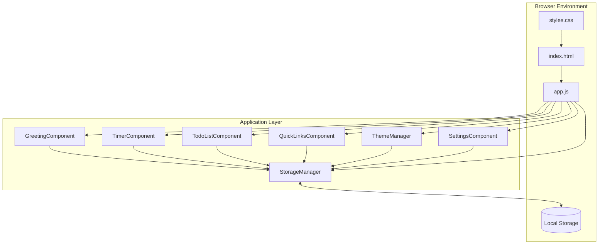
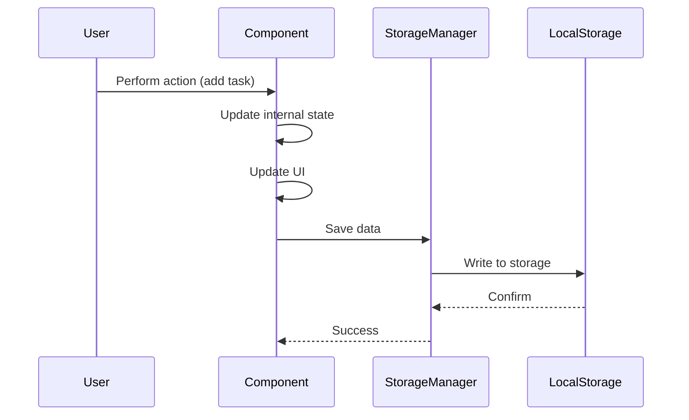

# Design Document: To-Do List Life Dashboard

## Overview

The To-Do List Life Dashboard is a client-side web application built with vanilla JavaScript, HTML, and CSS. It provides users with a personalized productivity interface featuring a time-based greeting, customizable focus timer, to-do list management, quick links to favorite websites, and light/dark theme support. All data persists locally using the browser's Local Storage API, requiring no backend infrastructure.

### Design Goals

1. **Simplicity**: Clean, minimal interface with intuitive interactions
2. **Performance**: Fast load times and responsive UI updates
3. **Maintainability**: Well-organized code structure with clear separation of concerns
4. **Accessibility**: Semantic HTML and keyboard-friendly controls
5. **Persistence**: Reliable data storage using Local Storage API

### Key Design Decisions

- **Vanilla JavaScript**: No frameworks to minimize complexity and bundle size
- **Component-Based Architecture**: Modular design with clear responsibilities
- **CSS Custom Properties**: Enable dynamic theme switching
- **Event-Driven Updates**: Reactive UI updates through event listeners
- **Single Page Application**: All functionality on one HTML page

## Architecture

### High-Level Architecture



### Application Structure

```
todo-list-life-dashboard/
├── index.html              # Main HTML structure
├── css/
│   └── styles.css          # All styles including themes
└── js/
    └── app.js              # All JavaScript logic
```

### Module Organization (within app.js)

The JavaScript file will be organized into logical sections:

1. **Constants and Configuration**
2. **Storage Manager** - Handles all Local Storage operations
3. **Theme Manager** - Manages light/dark theme switching
4. **Greeting Component** - Displays time, date, and personalized greeting
5. **Timer Component** - Focus timer with start/stop/reset controls
6. **Todo List Component** - Task management (add, edit, delete, complete)
7. **Quick Links Component** - Favorite website links management
8. **Settings Component** - User preferences (name, timer duration)
9. **Application Initialization** - Bootstrap and event binding

## Components and Interfaces

### 1. Storage Manager

**Responsibility**: Centralized interface for all Local Storage operations

**Interface**:
```javascript
StorageManager = {
  // Get item from storage
  get(key: string): any | null
  
  // Set item in storage
  set(key: string, value: any): void
  
  // Remove item from storage
  remove(key: string): void
  
  // Get all tasks
  getTasks(): Task[]
  
  // Save all tasks
  saveTasks(tasks: Task[]): void
  
  // Get all quick links
  getQuickLinks(): QuickLink[]
  
  // Save all quick links
  saveQuickLinks(links: QuickLink[]): void
  
  // Get user preferences
  getPreferences(): UserPreferences
  
  // Save user preferences
  savePreferences(prefs: UserPreferences): void
}
```

**Storage Keys**:
- `tasks` - Array of Task objects
- `quickLinks` - Array of QuickLink objects
- `preferences` - UserPreferences object (theme, name, pomodoroMinutes)

### 2. Theme Manager

**Responsibility**: Handle theme switching and persistence

**Interface**:
```javascript
ThemeManager = {
  // Initialize theme from storage
  init(): void
  
  // Toggle between light and dark themes
  toggle(): void
  
  // Set specific theme
  setTheme(theme: 'light' | 'dark'): void
  
  // Get current theme
  getCurrentTheme(): 'light' | 'dark'
}
```

**Implementation Approach**:
- Add/remove `dark-theme` class on `<body>` element
- CSS custom properties define colors for each theme
- Save theme preference to Local Storage on change

### 3. Greeting Component

**Responsibility**: Display current time, date, and time-based greeting

**Interface**:
```javascript
GreetingComponent = {
  // Initialize component
  init(containerElement: HTMLElement): void
  
  // Update time display (called every second)
  updateTime(): void
  
  // Update greeting based on time of day
  updateGreeting(): void
  
  // Update displayed name from preferences
  updateName(name: string | null): void
}
```

**Time-Based Greeting Logic**:
- 5:00 AM - 11:59 AM: "Good morning"
- 12:00 PM - 4:59 PM: "Good afternoon"
- 5:00 PM - 8:59 PM: "Good evening"
- 9:00 PM - 4:59 AM: "Good night"

**Update Strategy**:
- Use `setInterval` to update time every 1000ms
- Check for greeting change on each update
- Format: "Good morning, [Name]" or "Good morning" if no name set

### 4. Timer Component

**Responsibility**: Pomodoro-style focus timer with controls

**Interface**:
```javascript
TimerComponent = {
  // Initialize component
  init(containerElement: HTMLElement): void
  
  // Start countdown
  start(): void
  
  // Stop/pause countdown
  stop(): void
  
  // Reset to initial duration
  reset(): void
  
  // Update display
  updateDisplay(): void
  
  // Set duration from preferences
  setDuration(minutes: number): void
}
```

**State Management**:
```javascript
TimerState = {
  duration: number,        // Total duration in seconds
  remaining: number,       // Remaining time in seconds
  isRunning: boolean,      // Timer active state
  intervalId: number | null // setInterval reference
}
```

**Implementation Details**:
- Store duration in seconds internally
- Use `setInterval` with 1000ms interval when running
- Disable start button while running
- Format display as MM:SS
- Stop automatically when reaching zero

### 5. Todo List Component

**Responsibility**: Manage task list with CRUD operations

**Interface**:
```javascript
TodoListComponent = {
  // Initialize component
  init(containerElement: HTMLElement): void
  
  // Add new task
  addTask(text: string): void
  
  // Edit existing task
  editTask(id: string, newText: string): void
  
  // Delete task
  deleteTask(id: string): void
  
  // Toggle task completion
  toggleTask(id: string): void
  
  // Render all tasks
  render(): void
  
  // Save tasks to storage
  saveTasks(): void
}
```

**Task Data Model**:
```javascript
Task = {
  id: string,           // Unique identifier (timestamp + random)
  text: string,         // Task description (1-500 chars)
  completed: boolean,   // Completion status
  createdAt: number     // Timestamp
}
```

**UI Elements per Task**:
- Checkbox for completion toggle
- Text display (or input field when editing)
- Edit button
- Delete button

**Validation**:
- Text length: 1-500 characters
- Trim whitespace before validation

### 6. Quick Links Component

**Responsibility**: Manage favorite website links

**Interface**:
```javascript
QuickLinksComponent = {
  // Initialize component
  init(containerElement: HTMLElement): void
  
  // Add new quick link
  addLink(name: string, url: string): void
  
  // Delete quick link
  deleteLink(id: string): void
  
  // Open link in new tab
  openLink(url: string): void
  
  // Render all links
  render(): void
  
  // Save links to storage
  saveLinks(): void
}
```

**QuickLink Data Model**:
```javascript
QuickLink = {
  id: string,      // Unique identifier
  name: string,    // Display name
  url: string      // Website URL
}
```

**URL Validation**:
- Use regex or URL constructor to validate format
- Accept http://, https://, and protocol-relative URLs
- Show error message for invalid URLs

### 7. Settings Component

**Responsibility**: Manage user preferences

**Interface**:
```javascript
SettingsComponent = {
  // Initialize component
  init(containerElement: HTMLElement): void
  
  // Show settings modal/panel
  show(): void
  
  // Hide settings modal/panel
  hide(): void
  
  // Save custom name
  saveName(name: string): void
  
  // Save pomodoro duration
  saveDuration(minutes: number): void
  
  // Clear custom name
  clearName(): void
  
  // Reset duration to default
  resetDuration(): void
}
```

**UserPreferences Data Model**:
```javascript
UserPreferences = {
  theme: 'light' | 'dark',     // Theme preference
  customName: string | null,    // User's name (1-50 chars)
  pomodoroMinutes: number       // Timer duration (1-120 mins)
}
```

**Default Values**:
- theme: 'light'
- customName: null
- pomodoroMinutes: 25

## Data Models

### Local Storage Schema

**Key: `tasks`**
```json
[
  {
    "id": "1234567890-abc",
    "text": "Complete project documentation",
    "completed": false,
    "createdAt": 1234567890000
  }
]
```

**Key: `quickLinks`**
```json
[
  {
    "id": "1234567890-xyz",
    "name": "GitHub",
    "url": "https://github.com"
  }
]
```

**Key: `preferences`**
```json
{
  "theme": "dark",
  "customName": "Alex",
  "pomodoroMinutes": 30
}
```

### Data Flow



## UI/UX Design Considerations

### Layout Structure

```
┌─────────────────────────────────────────────────┐
│  Header                                         │
│  [Theme Toggle] [Settings]                      │
├─────────────────────────────────────────────────┤
│                                                 │
│  Greeting Section                               │
│  Good morning, Alex                             │
│  Monday, January 15, 2024 | 10:30 AM           │
│                                                 │
├─────────────────────────────────────────────────┤
│                                                 │
│  Focus Timer                                    │
│  ┌─────────────┐                               │
│  │   25:00     │                               │
│  └─────────────┘                               │
│  [Start] [Stop] [Reset]                        │
│                                                 │
├─────────────────────────────────────────────────┤
│                                                 │
│  To-Do List                                     │
│  [Add new task input] [Add]                    │
│                                                 │
│  ☐ Task 1 [Edit] [Delete]                     │
│  ☑ Task 2 [Edit] [Delete]                     │
│                                                 │
├─────────────────────────────────────────────────┤
│                                                 │
│  Quick Links                                    │
│  [Add link form]                               │
│                                                 │
│  [GitHub] [Gmail] [Calendar]                   │
│                                                 │
└─────────────────────────────────────────────────┘
```

### Visual Design Principles

1. **Hierarchy**: Clear visual separation between sections with 3px borders
2. **Spacing**: Generous whitespace for breathing room and elegant flow
3. **Typography**: Bold, modern fonts with refined styling (Inter font family, 600-800 weight)
4. **Contrast**: WCAG AA compliant color contrast ratios
5. **Feedback**: Visual feedback for all interactions (hover, active states)
6. **Color Harmony**: Smooth gradient transitions in light mode, balanced muted colors in dark mode
7. **Borders**: Consistent 3px borders on all containers and interactive elements

### Color Usage Guidelines

**Light Mode**:
- Background: Smooth gradient from #6367FF → #8494FF → #C9BEFF → #FFDBFD
- Cards/Containers: White or semi-transparent white with 3px colored borders
- Text: Dark, bold typography for maximum readability
- Accents: Use brand colors (#6367FF, #8494FF, #C9BEFF, #FFDBFD) for buttons and highlights

**Dark Mode**:
- Background: Dark solid color (#1a1a2e) with subtle radial gradients using muted brand colors
- Cards/Containers: Dark backgrounds (#0f1729, #16213e) with 3px muted colored borders
- Text: Light, bold typography (#e0e0e0)
- Accents: Muted versions of brand colors for harmony without harshness

### Interaction Patterns

**Task Management**:
- Click checkbox to toggle completion
- Click "Edit" to enter edit mode (inline editing)
- Press Enter or click "Save" to confirm edit
- Press Escape or click "Cancel" to abort edit
- Click "Delete" to remove task (no confirmation for simplicity)

**Timer Controls**:
- Start button initiates countdown
- Stop button pauses (can resume)
- Reset button returns to initial duration
- Start button disabled while running

**Quick Links**:
- Click link button to open in new tab
- Hover shows delete button (or always visible)
- Add form with name and URL inputs

**Settings**:
- Modal or slide-in panel
- Input fields for name and duration
- Save button applies changes
- Close button dismisses without saving (or auto-save on change)

### Responsive Behavior

**Desktop (> 768px)**:
- Multi-column layout where appropriate
- Larger text and spacing
- Hover states visible

**Mobile (≤ 768px)**:
- Single column layout
- Touch-friendly button sizes (min 44x44px)
- Simplified spacing
- No hover states (use active states)

## CSS Architecture

### Theme System

Use CSS custom properties for theme colors with custom color palette:

```css
:root {
  /* Brand Colors */
  --color-primary: #6367FF;
  --color-secondary: #8494FF;
  --color-tertiary: #C9BEFF;
  --color-accent: #FFDBFD;
  
  /* Light theme (default) */
  --bg-gradient: linear-gradient(135deg, #6367FF 0%, #8494FF 33%, #C9BEFF 66%, #FFDBFD 100%);
  --bg-primary: #ffffff;
  --bg-secondary: rgba(255, 255, 255, 0.9);
  --bg-card: rgba(255, 255, 255, 0.95);
  --text-primary: #2d2d2d;
  --text-secondary: #5a5a5a;
  --border-color: #6367FF;
  --border-width: 3px;
  --success: #4caf50;
  --danger: #f44336;
  --shadow: rgba(99, 103, 255, 0.15);
}

body.dark-theme {
  /* Dark theme - no gradients, muted colors */
  --bg-gradient: none;
  --bg-primary: #1a1a2e;
  --bg-secondary: #16213e;
  --bg-card: #0f1729;
  --text-primary: #e0e0e0;
  --text-secondary: #a0a0a0;
  --border-color: #8494FF;
  --border-width: 3px;
  --success: #66bb6a;
  --danger: #ef5350;
  --shadow: rgba(132, 148, 255, 0.2);
  
  /* Muted brand colors for dark mode accents */
  --color-primary-muted: rgba(99, 103, 255, 0.6);
  --color-secondary-muted: rgba(132, 148, 255, 0.5);
  --color-tertiary-muted: rgba(201, 190, 255, 0.4);
  --color-accent-muted: rgba(255, 219, 253, 0.3);
}
```

### Typography System

Modern, bold typography for enhanced readability:

```css
/* Import modern font (e.g., Inter, Poppins, or system fonts) */
@import url('https://fonts.googleapis.com/css2?family=Inter:wght@400;600;700;800&display=swap');

:root {
  --font-family: 'Inter', -apple-system, BlinkMacSystemFont, 'Segoe UI', sans-serif;
  --font-weight-normal: 600;
  --font-weight-bold: 700;
  --font-weight-extra-bold: 800;
  
  --font-size-xs: 0.75rem;    /* 12px */
  --font-size-sm: 0.875rem;   /* 14px */
  --font-size-base: 1rem;     /* 16px */
  --font-size-lg: 1.125rem;   /* 18px */
  --font-size-xl: 1.5rem;     /* 24px */
  --font-size-2xl: 2rem;      /* 32px */
  --font-size-3xl: 2.5rem;    /* 40px */
}

body {
  font-family: var(--font-family);
  font-weight: var(--font-weight-normal);
  line-height: 1.6;
}

h1, h2, h3, h4, h5, h6 {
  font-weight: var(--font-weight-extra-bold);
  line-height: 1.2;
}

button, .btn {
  font-weight: var(--font-weight-bold);
}
```

### Border and Container Styling

All containers and boxes use 3px borders:

```css
.card, .section, .input-group, .timer-display, .task-item, .quick-link-btn {
  border: var(--border-width) solid var(--border-color);
  border-radius: 12px;
  box-shadow: 0 4px 12px var(--shadow);
}

/* Light mode specific - gradient background */
body:not(.dark-theme) {
  background: var(--bg-gradient);
  background-attachment: fixed;
}

/* Dark mode specific - solid background with subtle color hints */
body.dark-theme {
  background: var(--bg-primary);
  position: relative;
}

body.dark-theme::before {
  content: '';
  position: fixed;
  top: 0;
  left: 0;
  right: 0;
  bottom: 0;
  background: 
    radial-gradient(circle at 20% 30%, var(--color-primary-muted) 0%, transparent 50%),
    radial-gradient(circle at 80% 70%, var(--color-secondary-muted) 0%, transparent 50%),
    radial-gradient(circle at 50% 50%, var(--color-tertiary-muted) 0%, transparent 60%);
  pointer-events: none;
  z-index: -1;
}
```

### Component Styling Strategy

1. **Base Styles**: Reset and typography
2. **Layout Styles**: Grid/flexbox for structure
3. **Component Styles**: Scoped to component classes
4. **Utility Classes**: Reusable helpers (e.g., `.hidden`, `.error`)
5. **Theme Styles**: Color definitions using custom properties

### CSS Organization

```css
/* 1. CSS Reset & Base */
*, *::before, *::after { box-sizing: border-box; }
body { margin: 0; font-family: ...; }

/* 2. CSS Custom Properties (Themes) */
:root { ... }
body.dark-theme { ... }

/* 3. Layout */
.container { ... }
.section { ... }

/* 4. Components */
.greeting { ... }
.timer { ... }
.todo-list { ... }
.quick-links { ... }
.settings { ... }

/* 5. Utilities */
.hidden { display: none; }
.error { color: var(--danger); }

/* 6. Responsive */
@media (max-width: 768px) { ... }
```

## Implementation Approach

### Phase 1: Foundation

1. **HTML Structure**
   - Create semantic HTML with all sections
   - Add IDs and classes for JavaScript hooks
   - Include accessibility attributes (ARIA labels)

2. **CSS Base**
   - Implement theme system with custom properties using brand colors (#6367FF, #8494FF, #C9BEFF, #FFDBFD)
   - Create gradient background for light mode (smooth transition between colors)
   - Create solid background with subtle color hints for dark mode (no gradients)
   - Implement 3px borders on all containers and interactive elements
   - Set up bold typography system with Inter font (weights 600-800)
   - Create base layout and responsive structure
   - Style all components in both themes with refined, modern aesthetics

3. **Storage Manager**
   - Implement get/set/remove methods
   - Add specialized methods for tasks, links, preferences
   - Handle JSON serialization/deserialization
   - Add error handling for storage quota exceeded

### Phase 2: Core Components

4. **Theme Manager**
   - Implement theme toggle functionality
   - Load theme preference on init
   - Apply theme class to body

5. **Greeting Component**
   - Implement time/date display with formatting
   - Add time-based greeting logic
   - Set up interval for automatic updates
   - Integrate with user name preference

6. **Timer Component**
   - Implement countdown logic
   - Add start/stop/reset controls
   - Format time display (MM:SS)
   - Integrate with duration preference
   - Handle timer completion

### Phase 3: Data Management

7. **Todo List Component**
   - Implement task rendering
   - Add task creation with validation
   - Implement inline editing
   - Add completion toggle
   - Implement task deletion
   - Integrate with Local Storage

8. **Quick Links Component**
   - Implement link rendering
   - Add link creation with URL validation
   - Implement link deletion
   - Add click handler to open in new tab
   - Integrate with Local Storage

### Phase 4: Settings & Polish

9. **Settings Component**
   - Create settings UI (modal or panel)
   - Implement name input and save
   - Implement duration input with validation
   - Add clear/reset functionality
   - Integrate with preferences storage

10. **Application Initialization**
    - Load all data from Local Storage
    - Initialize all components
    - Set up event listeners
    - Handle initial render

11. **Testing & Refinement**
    - Test all user interactions
    - Verify Local Storage persistence
    - Test theme switching
    - Verify responsive behavior
    - Cross-browser testing

### Error Handling Strategy

**Local Storage Errors**:
- Catch quota exceeded errors
- Show user-friendly error messages
- Gracefully degrade if storage unavailable

**Validation Errors**:
- Validate input before processing
- Show inline error messages
- Prevent invalid data from being saved

**Runtime Errors**:
- Use try-catch blocks for critical operations
- Log errors to console for debugging
- Maintain application stability

### Performance Optimizations

1. **Minimize DOM Manipulation**
   - Batch updates where possible
   - Use document fragments for multiple insertions
   - Cache DOM references

2. **Efficient Event Handling**
   - Use event delegation for dynamic elements
   - Debounce rapid events if needed
   - Remove event listeners when not needed

3. **Storage Optimization**
   - Only save when data changes
   - Use efficient JSON serialization
   - Avoid unnecessary reads

4. **Rendering Optimization**
   - Only re-render changed elements
   - Use CSS for visual changes when possible
   - Minimize reflows and repaints

## Error Handling

### Storage Errors

**Quota Exceeded**:
```javascript
try {
  localStorage.setItem(key, value);
} catch (e) {
  if (e.name === 'QuotaExceededError') {
    // Show error: "Storage limit reached. Please delete some items."
  }
}
```

**Storage Unavailable**:
```javascript
function isStorageAvailable() {
  try {
    const test = '__storage_test__';
    localStorage.setItem(test, test);
    localStorage.removeItem(test);
    return true;
  } catch (e) {
    return false;
  }
}
```

### Validation Errors

**Task Text Validation**:
- Check length (1-500 characters)
- Trim whitespace
- Show error message if invalid

**URL Validation**:
```javascript
function isValidURL(string) {
  try {
    new URL(string);
    return true;
  } catch (_) {
    return false;
  }
}
```

**Duration Validation**:
- Check range (1-120 minutes)
- Ensure positive integer
- Show error message if invalid

### User Feedback

**Success States**:
- Visual confirmation (e.g., checkmark animation)
- Updated UI reflects changes immediately

**Error States**:
- Red text or border for invalid inputs
- Error message below input field
- Clear instructions for correction

**Loading States**:
- Not typically needed (operations are synchronous)
- Could add for future async operations

## Testing Strategy

### Manual Testing Checklist

**Greeting Component**:
- [ ] Time updates every second
- [ ] Date displays correctly
- [ ] Greeting changes based on time of day
- [ ] Custom name appears when set
- [ ] Generic greeting shows when no name

**Timer Component**:
- [ ] Timer initializes with correct duration
- [ ] Start button begins countdown
- [ ] Stop button pauses countdown
- [ ] Reset button returns to initial duration
- [ ] Timer stops at zero
- [ ] Display formats correctly (MM:SS)
- [ ] Start button disabled while running

**Todo List**:
- [ ] Tasks load from storage on init
- [ ] New tasks can be added
- [ ] Tasks can be edited
- [ ] Tasks can be deleted
- [ ] Tasks can be marked complete/incomplete
- [ ] Completed tasks show visual distinction
- [ ] Changes persist to storage
- [ ] Validation prevents empty tasks
- [ ] Validation enforces character limit

**Quick Links**:
- [ ] Links load from storage on init
- [ ] New links can be added
- [ ] Links can be deleted
- [ ] Clicking link opens in new tab
- [ ] URL validation prevents invalid URLs
- [ ] Changes persist to storage

**Settings**:
- [ ] Settings panel opens/closes
- [ ] Custom name can be set
- [ ] Custom name can be cleared
- [ ] Timer duration can be customized
- [ ] Timer duration can be reset to default
- [ ] Validation enforces name length (1-50)
- [ ] Validation enforces duration range (1-120)
- [ ] Changes persist to storage
- [ ] Changes reflect in UI immediately

**Theme**:
- [ ] Theme toggle switches between light/dark
- [ ] Theme preference persists to storage
- [ ] Theme loads correctly on init
- [ ] All components styled correctly in both themes
- [ ] Default theme is light

**Persistence**:
- [ ] All data persists across page reloads
- [ ] Storage updates within 100ms of changes
- [ ] Empty storage handled gracefully

**Browser Compatibility**:
- [ ] Works in Chrome
- [ ] Works in Firefox
- [ ] Works in Edge
- [ ] Works in Safari

**Responsive Design**:
- [ ] Layout adapts to mobile screens
- [ ] Touch targets are adequate size
- [ ] All features accessible on mobile

### Unit Testing Approach

While the requirements specify no test setup is required, here are testable units if tests were to be added:

**Storage Manager**:
- Test get/set/remove operations
- Test JSON serialization/deserialization
- Test error handling for quota exceeded

**Validation Functions**:
- Test task text validation (length, whitespace)
- Test URL validation (valid/invalid formats)
- Test duration validation (range, type)

**Time-Based Logic**:
- Test greeting selection based on hour
- Test time formatting (MM:SS)
- Test date formatting

**Data Transformations**:
- Test task creation (ID generation, defaults)
- Test quick link creation
- Test preferences merging with defaults

## Correctness Properties

*A property is a characteristic or behavior that should hold true across all valid executions of a system—essentially, a formal statement about what the system should do. Properties serve as the bridge between human-readable specifications and machine-verifiable correctness guarantees.*

### Assessment: Property-Based Testing Applicability

This feature is **NOT suitable for comprehensive property-based testing** because:

1. **UI-Heavy Application**: Most requirements involve UI rendering, user interactions, and visual feedback which are not easily testable with universal properties
2. **Side-Effect Operations**: Many operations involve Local Storage writes, DOM manipulation, and timer management which are side-effectful
3. **Simple CRUD Operations**: Task and link management are straightforward create/read/update/delete operations without complex transformation logic
4. **Configuration and State Management**: Much of the application is about managing user preferences and UI state

**However**, there are a few pure functions and data transformations that ARE suitable for property-based testing:

- Time-based greeting selection logic
- Time formatting functions
- URL validation
- Input validation (task text, duration, name length)
- Data serialization/deserialization

For these limited pure functions, property-based testing could provide value, but the majority of the application is better tested with:
- **Example-based unit tests** for specific behaviors
- **Integration tests** for Local Storage interactions
- **Manual testing** for UI/UX verification

Given that the requirements explicitly state "No test setup required" (NFR-1), and the limited scope where PBT would apply, **we will skip the Correctness Properties section** and focus on example-based testing strategies in the Testing Strategy section above.

## Security Considerations

### XSS Prevention

**User Input Sanitization**:
- Use `textContent` instead of `innerHTML` for user-generated content
- Sanitize URLs before creating links
- Validate all input before storage

**Safe DOM Manipulation**:
```javascript
// Safe: Uses textContent
element.textContent = userInput;

// Unsafe: Could execute scripts
element.innerHTML = userInput; // AVOID
```

### Local Storage Security

**Data Exposure**:
- Local Storage is accessible to any script on the same origin
- Do not store sensitive information (passwords, tokens)
- Data is not encrypted by default

**Storage Limits**:
- Handle quota exceeded gracefully
- Implement data cleanup if needed

### URL Validation

**Prevent JavaScript URLs**:
```javascript
function isSafeURL(url) {
  try {
    const parsed = new URL(url);
    return parsed.protocol === 'http:' || parsed.protocol === 'https:';
  } catch {
    return false;
  }
}
```

## Accessibility Considerations

### Semantic HTML

- Use `<button>` for interactive elements
- Use `<input>` with proper `type` attributes
- Use `<label>` elements for form inputs
- Use heading hierarchy (`<h1>`, `<h2>`, etc.)

### ARIA Attributes

**Timer Component**:
```html
<div role="timer" aria-live="polite" aria-atomic="true">
  <span id="timer-display">25:00</span>
</div>
```

**Task List**:
```html
<ul role="list" aria-label="To-do list">
  <li role="listitem">
    <input type="checkbox" id="task-1" aria-label="Mark task as complete">
    <label for="task-1">Task description</label>
  </li>
</ul>
```

**Settings Modal**:
```html
<div role="dialog" aria-labelledby="settings-title" aria-modal="true">
  <h2 id="settings-title">Settings</h2>
  <!-- Settings content -->
</div>
```

### Keyboard Navigation

- All interactive elements accessible via Tab
- Enter key activates buttons
- Escape key closes modals
- Focus management for modals (trap focus, restore on close)

### Screen Reader Support

- Provide descriptive labels for all inputs
- Announce dynamic content changes (aria-live)
- Provide context for icon-only buttons (aria-label)

## Future Enhancements

While not in current requirements, these could be future additions:

1. **Timer Notifications**: Browser notifications when timer completes
2. **Task Categories**: Organize tasks into categories or projects
3. **Task Priorities**: High/medium/low priority levels
4. **Task Due Dates**: Add deadlines to tasks
5. **Data Export/Import**: Backup and restore functionality
6. **Keyboard Shortcuts**: Power user features
7. **Task Search/Filter**: Find tasks quickly
8. **Statistics**: Track completed tasks over time
9. **Multiple Timer Presets**: Short break, long break, etc.
10. **Drag and Drop**: Reorder tasks

## Conclusion

This design provides a comprehensive blueprint for implementing the To-Do List Life Dashboard. The architecture emphasizes simplicity, maintainability, and user experience while meeting all functional and non-functional requirements. The component-based structure allows for clear separation of concerns, making the codebase easy to understand and extend. The use of vanilla JavaScript ensures minimal complexity and fast performance, while the Local Storage integration provides reliable data persistence without requiring backend infrastructure.

